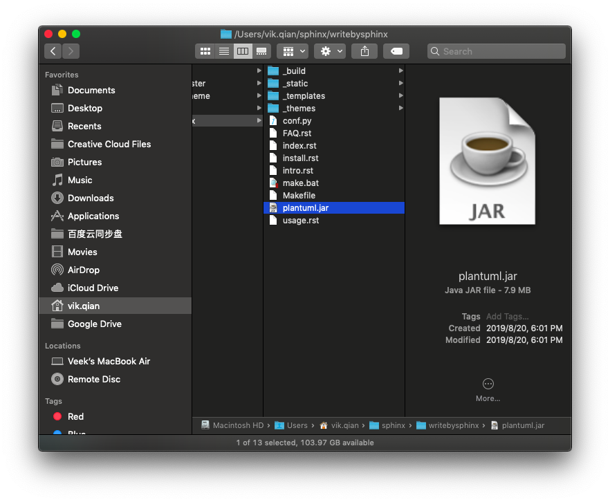

安装设置
================

你不必安装本文所列的所有程序，实际上你只需要一个文本编辑器就能参与编写sphinx文档，通过git或svn等版本管理工具，
整个团队可以进行有效协作，而将文本编译为html或pdf，可以交给服务器去做。

如果你要重度参与编写sphinx文档，那么安装本文所列工具后，你将获得非常强大的文档编辑的能力，包括布局、画图、建立
索引、自动化格式（尤其是各种代码格式）、内容参数化以及一些自动化功能。

安装Python虚拟机
----------------------

为什么要用虚拟机？ `这里参考一个博客的说法如下 <https://blog.csdn.net/godot06/article/details/81079064>`_ 

在实际项目开发中，我们通常会根据自己的需求去下载各种相应的框架库，
如Scrapy、Beautiful Soup等，但是可能每个项目使用的框架库并不一样，
或使用框架的版本不一样，这样需要我们根据需求不断的更新或卸载相应的库。
直接怼我们的Python环境操作会让我们的开发环境和项目造成很多不必要的麻烦，
管理也相当混乱。

场景1：项目A需要某个框架1.0版本，项目B需要这个库的2.0版本。
如果没有安装虚拟环境，那么当你使用这两个项目时，你就需要来回的卸载
安装了，这样很容易就给你的项目带来莫名的错误。

场景2：公司之前的项目需要python2.7环境下运行，而你接手的项目需要在
python3环境中运行，想想就应该知道，如果不使用虚拟环境，这这两个项目
可能无法同时使用，使用python3则公司之前的项目可能无法运行，反之则
新项目运行有麻烦。而如果虚拟环境可以分别为这两个项目配置不同的运行环境，
这样两个项目就可以同时运行。

下面是安装Python虚拟机的简单方法：

.. code-block:: shell

    #安装python虚拟环境应用
    $ pip install virtualenv
    #或者用 pip3 install virtualenv

    #新建python虚拟机目录，并创建虚拟机，我这里用sphinx-doc作为虚拟机名字
    MacBook:~ vik.qian$ mkdir pyenv
    MacBook:pyenv vik.qian$ cd pyenv
    MacBook:pyenv vik.qian$ virtualenv sphinx-doc

    #激活虚拟机
    MacBook:pyenv vik.qian$ source sphinx-doc/bin/activate
    (sphinx-doc) MacBook:pyenv vik.qian$
    #前面多了个括号，说明进入了虚拟机

    #退出虚拟机
    (sphinx-doc) MacBook:pyenv vik.qian$ deactivate

安装sphinx
----------------------

安装到Linux
~~~~~~~~~~~~~~~~

当然是通过 `官网链接`__ 说明安装，以下English内容引用官网。

__ http://www.sphinx-doc.org/en/master/usage/installation.html

.. note::

    使用命令请在相应的python虚拟机运行安装 

Debian/Ubuntu
....................

Install either ``python3-sphinx`` (Python 3) or ``python-sphinx`` (Python 2)
using :command:`apt-get`:

::

   $ apt-get install python3-sphinx

If it not already present, this will install Python for you.

RHEL, CentOS
....................

Install ``python-sphinx`` using :command:`yum`:

::

   $ yum install python-sphinx

If it not already present, this will install Python for you.

Other distributions
.........................

Most Linux distributions have Sphinx in their package repositories.  Usually
the package is called ``python3-sphinx``, ``python-sphinx`` or ``sphinx``.  Be
aware that there are at least two other packages with ``sphinx`` in their name:
a speech recognition toolkit (*CMU Sphinx*) and a full-text search database
(*Sphinx search*).

安装到macOS
~~~~~~~~~~~~

Sphinx can be installed using `Homebrew`__, `MacPorts`__, or as part of
a Python distribution such as `Anaconda`__.

__ https://brew.sh/
__ https://www.macports.org/
__ https://www.anaconda.com/download/#macos

Homebrew
...............

::

   $ brew install sphinx-doc

For more information, refer to the `package overview`__.

__ https://formulae.brew.sh/formula/sphinx-doc

MacPorts
..............

Install either ``python36-sphinx`` (Python 3) or ``python27-sphinx`` (Python 2)
using :command:`port`:

::

   $ sudo port install py36-sphinx

To set up the executable paths, use the ``port select`` command:

::

   $ sudo port select --set python python36
   $ sudo port select --set sphinx py36-sphinx

For more information, refer to the `package overview`__.

__ https://www.macports.org/ports.php?by=library&substr=py36-sphinx

Anaconda
...............

::

   $ conda install sphinx

安装到Windows
~~~~~~~~~~~~~~~~~~

Most Windows users do not have Python installed by default, so we begin with
the installation of Python itself.  To check if you already have Python
installed, open the *Command Prompt* (:kbd:`⊞Win-r` and type :command:`cmd`).
Once the command prompt is open, type :command:`python --version` and press
Enter.  If Python is installed, you will see the version of Python printed to
the screen.  If you do not have Python installed, refer to the `Hitchhikers
Guide to Python's`__ Python on Windows installation guides. You must install
`Python 3`__.

Once Python is installed, you can install Sphinx using :command:`pip`.  Refer
to the :ref:`pip installation instructions <install-pypi>` below for more
information.

__ https://docs.python-guide.org/
__ https://docs.python-guide.org/starting/install3/win/

.. _install-pypi:

Installation from PyPI
.............................

Sphinx packages are published on the `Python Package Index
<https://pypi.org/project/Sphinx/>`_.  The preferred tool for installing
packages from *PyPI* is :command:`pip`.  This tool is provided with all modern
versions of Python.

On Linux or MacOS, you should open your terminal and run the following command.

::

   $ pip install -U sphinx

On Windows, you should open *Command Prompt* (:kbd:`⊞Win-r` and type
:command:`cmd`) and run the same command.

.. code-block:: doscon

   C:\> pip install -U sphinx

After installation, type :command:`sphinx-build --version` on the command
prompt.  If everything worked fine, you will see the version number for the
Sphinx package you just installed.

Installation from *PyPI* also allows you to install the latest development
release.  You will not generally need (or want) to do this, but it can be
useful if you see a possible bug in the latest stable release.  To do this, use
the ``--pre`` flag.

::

   $ pip install -U --pre sphinx

安装VSCode
-----------------
Visual Studio Code 可能是我使用过的最酷的文档编辑器，超级好用，且有很多插件，强烈推荐使用VSCode写sphinx文档。
正如，我现在在使用的，VSCode也支持reStructuredText语言，且支持实时预览 -- 如果你习惯于写Markdown时实时预览的话，
你会喜欢的。VSCode安装地址 `https://code.visualstudio.com/ <https://code.visualstudio.com/>`_ 。

    用 Visual Studio Code编辑reStructuredText，并渲染为html

.. note::

    如果系统有多个版本python，配置不对可能导致VSCode渲染html失败，可以在VSCode setting中设置python的path，从而使用正确的版本：
    ``"python.pythonPath": "/Users/vik.qian/pythonvenvs/sphinx-doc/bin/python3`` ，如下图：

    setting.json中设置python版本 

.. hint::

    注意：VSCode可以安装许多插件，一些插件会影响编辑习惯，比如如果安装了默认VIM风格的输入方式，
    那么你必须按照VIM方式进行输入，如果不习惯则可以考虑禁用这些插件。

安装主题
-----------------

sphinx默认主题alabaster太素，可以选一个最经典的主题 `sphinx_rtd_theme <https://sphinx-rtd-theme.readthedocs.io/en/stable/>`_ ，
直接用这个命令装：
::

    pip install sphinx_rtd_theme

.. note::

    命令请在相应的python虚拟机运行安装 

在conf.py配置
~~~~~~~~~~~~~~~~~~

.. code-block:: python

    import sphinx_rtd_theme
    html_theme = 'sphinx_rtd_theme

.. _solve_too_big_width_table_problem:

解决表格过宽问题
~~~~~~~~~~~~~~~~~~~

主题 *sphinx_rtd_theme* 的表格有个内容无法换行的bug，导致许多表格过宽，
参考这个 `网站 <https://rackerlabs.github.io/docs-rackspace/tools/rtd-tables.html>`_ 
的方法，重载css并在conf.py配置后，就可以解决。

The **Read the Docs** Sphinx theme contains a bug that causes text in table
cells not to wrap. This results in very wide tables with horizontal scroll
bars.

You can workaround this issue by defining a custom CCS override file.

#. Change into your documentation directory. This is usually where
   the ``index.rst`` and ``conf.py`` files are located:

   .. code::

      $ cd doc

#. If it does not already exist, create a ``_static`` directory:

   .. code::

      $ mkdir _static

#. Create a ``theme_overrides.css`` file in the ``_static`` directory:

   .. code::

      $ touch _static/theme_overrides.css

#. Open the ``theme_overrides.css`` file and add the following CSS:

   .. code::

      /* override table width restrictions */
      @media screen and (min-width: 767px) {

         .wy-table-responsive table td {
            /* !important prevents the common CSS stylesheets from overriding
               this as on RTD they are loaded after this stylesheet */
            white-space: normal !important;
         }

         .wy-table-responsive {
            overflow: visible !important;
         }
      }

#. Open the ``conf.py`` file and add the following configuration options:

   .. code::

      html_static_path = ['_static']

      html_context = {
          'css_files': [
              '_static/theme_overrides.css',  # override wide tables in RTD theme
              ],
           }

#. Build your documentation using Sphinx and check the tables; cells should
   now wrap correctly.

安装画图工具
-----------------

文档中的图最好都能够用脚本描述，工具自动画，这样有利于版本维护，推荐使用plantuml和Graphviz，
前者用来画UML图，后者可以画状态转移图。

安装sphinxcontrib-plantuml
~~~~~~~~~~~~~~~~~~~~~~~~~~~~~~~~~~~

plantuml.jar是个java程序，运行起来有点慢，但功能强大，也还能接受。

.. note::

    使用命令请在相应的python虚拟机运行安装 

pip安装
.................
::

    pip install sphinxcontrib-plantuml

下载安装
.................

点击官网页面“Download”链接下载。
下载完，解压，运行命令：

::

    python setup.py install

修改Sphinx文档配置
~~~~~~~~~~~~~~~~~~~~~~~~~~~~

找到文档目录中的conf.py文件，添加extension和plantuml调用指令。

.. code-block:: python

    import os

    # Add any Sphinx extension module names here, as strings. They can be
    # extensions coming with Sphinx (named 'sphinx.ext.*') or your custom
    # ones.
    extensions = ['sphinxcontrib.plantuml',
                  'sphinx.ext.graphviz']

    # 设置 plantuml.jar 路径
    currentpath = os.getcwd() + '/'
    plantuml = 'java -jar ' + currentpath + 'plantuml.jar'

下载 plantuml.jar 文件
~~~~~~~~~~~~~~~~~~~~~~~~~~~~~

`下载 plantuml.jar 文件 <http://plantuml.com/zh/download>`_，plantuml放在当前工程目录（因为conf.py中，假设是放在当前工作目录 
``currentpath = os.getcwd() + '/'`` ）。

    注意 plantuml放对目录以便 java命令能找到它

安装 graphviz
~~~~~~~~~~~~~~~~~~~~~

Graphviz是一个很轻量的软件，性能非常好，用起来飞一样。

.. note::

    使用命令请在相应的python虚拟机运行安装 

`Graphviz的安装说明网站 <https://pypi.org/project/graphviz/>`_ ，最简单的安装命令如下 

::

    $ pip install graphviz

需要在conf.py中进行如下配置：

.. code-block:: python

    extensions = ['sphinxcontrib.plantuml',
                'sphinx.ext.graphviz']

    # 设置 graphviz_dot 布局风格
    # dot 默认布局方式，主要用于有向图
    # neato 基于spring-model(又称force-based)算法   基于斥力+张力的布局
    # twopi 径向布局
    # circo 圆环布局
    # osage
    # fdp 用于无向图
    # sfdp 用于无向图
    graphviz_dot = 'dot'

    # 设置 graphviz_dot_args 的参数，这里默认了默认字体
    graphviz_dot_args = ['-Gfontname=Georgia', 
                        '-Nfontname=Georgia',
                        '-Efontname=Georgia']
    # 输出格式，默认png，这里我用svg矢量图
    graphviz_output_format = 'svg

安装PDF转换工具
-----------------

有时候文档需要发布到pdf，`这篇博客写了如何转pdf <https://dormouse-youngs-blog.readthedocs.io/en/latest/rst-pdf.html>`_ ，我还没试过，
主要是 MacTeX/TeXLive 太大，适合装在服务器端。