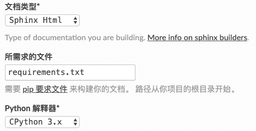

FAQ
=======

.. index:: 目录设置

目录设置问题
---------------

为了方便基于目录的版本管理，我们可以将文档源文件和分离，可以在使用sphinx-quickstart时
设置source和build为不同目录。也可以后期在Makefile(Mac, Linux)或make.bat(Windows)文件进行设置。

例如，将：

.. code-block:: bash

    SOURCEDIR     = .
    BUILDDIR      = _build

改为

.. code-block:: bash

    SOURCEDIR     = source/
    BUILDDIR      = build/

.. hint::

    于此同时，你应该将除Makefile文件和_build目录文件之外的其它所有源文件移到source目录中。
    另外，为了防止将build目录下的文件也同步到git上，你可以设置.gitignore或/info/exclude文件，
    来忽略上传这个目录的文件。

为什么有些目录没更新？
---------------------------

由于sphinx是增量编译的，对于没有变化的文件是不会去重新编译处理，如果只是更新了根目录下的index.rst文件内容，
并且增加新的对应文件，可能会导致首页目录正常，有些老旧页面目录没有更新的情况。

处理办法：**只要删除已经build的文件目录，重新生成一遍即可**。

.. index:: 使用readthedocs

Read the Docs部分设置注意点
---------------------------------

总体而言，readthedocs还是比较容易设置的，如果出错，也有明确的错误输出，根据其错误输出解决问题即可。
比如本sphinx工程用到了plantuml画图工具，网站提示plantuml没有安装，那么我们只要新增加一个文本文件
requirements.txt，放在根目录即可。其中requirements文件内容为::

    sphinxcontrib-plantuml
    graphvi

然后在网站上高级设置中填上这个文件名，它就会自动去安装了，如下图。

另一个碰到的问题是编译警告出错，提示找不到content.rst，原因是readthedocs默认认为初始文件是content.rst，
只要在conf.py文件中增加一行配置，告知系统初始文件名（不用带后缀）即可。

.. code-block:: python

    master_doc = 'index'

.. index:: 使用Markdown

在Sphinx上使用Markdown
-----------------------------

虽然不建议用Markdown写大型文档，但目前有大量现存Markdown写的文档，可以支持将其移植进来。

Sphinx支持用Markdown进行写作。

启用Markdown需要如下步骤：

安装recommonmark：:
::

    pip install recommonmark

添加如下内容到conf.py中：:

::

    source_parsers = {
    '.md': 'recommonmark.parser.CommonMarkParser',
    }

添加Markdown的文件扩展名到配置文件的source_suffix变量：:

::

    source_suffix = ['.rst', '.md']

