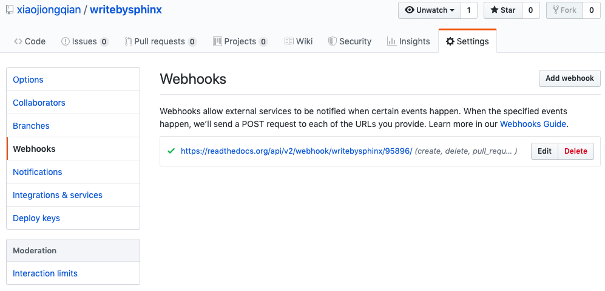
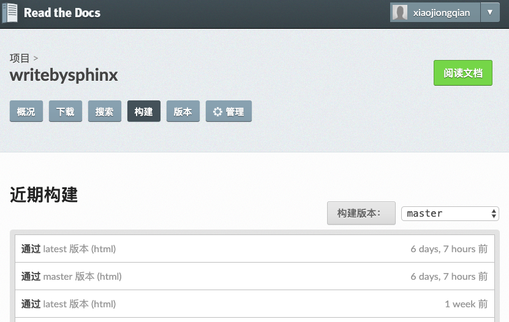

发布文档
=================

通过Github和readthedoc发布
-------------------------------

基本流程是：用 Sphinx 生成文档，GitHub 托管文档，再导入到 ReadtheDocs。不重复造轮子，以下攻略
引用于 `一个博客 <https://www.xncoding.com/2017/01/22/fullstack/readthedoc.html>`_ 。

将文档托管到版本控制系统比如github上面，push源码后自动构建发布到readthedoc上面， 
这样既有版本控制好处，又能自动发布到readthedoc，实在是太方便了。

先在GitHub创建一个仓库名字叫writebysphinx， 然后在本地.gitignore文件中添加build/目录，
初始化git，commit后，添加远程仓库。

具体几个步骤非常简单，参考官方文档：https://github.com/rtfd/readthedocs.org:

1. 在Read the Docs上面注册一个账号

2. 登陆后点击 “Import”

3. 给该文档项目填写一个名字比如 “writebysphinx”, 并添加你在GitHub上面的工程HTTPS链接, 选择仓库类型为Git

4. 其他项目根据自己的需要填写后点击 “Create”，创建完后会自动去激活Webhooks，不用再去GitHub设置，
激活后可以在Github的Webhooks中看到配置生效

5. 一切搞定，从此只要你往这个仓库push代码，readthedoc上面的文档就会自动更新

在公司内部发布
----------------------

基本流程是：用 Sphinx 生成文档，公司Git仓库管理文档版本，提交版本时通过Jenkins的机制在服务器端触发Sphinx编译，
并将build文件同步到Web服务器。

- 需要在Jenkins上配置一个pipeline工程，在git提交新版本时触发脚本
- 编写那个脚本，让服务器自动运行make html，并将build目录下的文件同步到Web服务器
