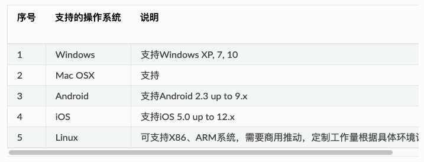

基本用法
=================

这里只是介绍我在用这个工具一周内碰到的常用问题，比较浅显，但应该是碰到概率较高的情况，做个记录供参考。更详细的参考应查阅
`sphinx手册 <https://zh-sphinx-doc.readthedocs.io/en/latest/index.html>`_ ，
这个是 `英文版 <http://www.sphinx-doc.org/en/master/>`_ 。

基本布局
----------------

**使用align、width设置，使得布局舒适**

*丑的做法(图片太大)*

.. code-block:: reStructuredText

    .. image:: _static/justalk-ct.png

|

*好的做法（图片适中，并居中）*

.. code-block:: reStructuredText

    .. image:: _static/justalk-ct.png
        :align: center
        :width: 70%

制表格技巧
----------------

Grid table比较难用，除非必要，尽量使用list-table 或 simple talbe 或 csv-table。

list-table和simple table非常简单，而csv-table最紧凑，也可以考虑在excel表格中编辑好后，
存为csv格式再copy过来，比如：

.. code-block:: reStructuredText

    .. csv-table:: bitrate per resolution -- csv talbe sample
        :header: "分辨率","Lowest br", "Enough br", "High br"

        1080p,"1,546","2,782","4,637"
        720p,876,"1,577","2,628"
        Quad-VGA,"1,072","1,929","3,215"
        XGA,784,"1,411","2,352"
        SVGA,555,999,"1,665"
        VGA,406,731,"1,218"
        Quarter-VGA,154,277,462
        CIF,187,336,561
        QCIF,71,127,212
        subQCIF,43,77,128

呈现如下：

.. csv-table:: bitrate per resolution -- csv talbe sample
    :header: "分辨率","Lowest br", "Enough br", "High br"
    :align: center

    1080p,"1,546","2,782","4,637"
    720p,876,"1,577","2,628"
    Quad-VGA,"1,072","1,929","3,215"
    XGA,784,"1,411","2,352"
    SVGA,555,999,"1,665"
    VGA,406,731,"1,218"
    Quarter-VGA,154,277,462
    CIF,187,336,561
    QCIF,71,127,212
    subQCIF,43,77,128

Sphinx默认的主题有个表格过宽的问题，如下图。

    表格过宽，导致有横向滑动条

通过重载css可以解决这个问题，详见
:ref:`解决表格过宽问题 <solve_too_big_width_table_problem>`。解决后，表格中内容会自动换行：

===== ================================= =============================
 序号    支持的操作系统                         说明
===== ================================= =============================
 1     Windows                            支持Windows XP, 7, 10
 2     Mac OSX                            支持
 3     Android                            支持Android 2.3 up to 9.x
 4     iOS                                支持iOS 5.0 up to 12.x
 5     Linux                              可支持X86、ARM系统，需要商用推动，定制工作量根据具体环境评估   
===== ================================= =============================

注意空行和空格
----------------
熟悉python开发的都知道，源码中空行和空格都是关键的“代码”，有时候少一行或少一个空格都会导致语法错误。

**例如，要保留原输出格式，以下写法会不按照你的想法来：**

::

    ::
        没有空行，语法错误！

*实际输出：*

::
    没有空行，语法错误！

**正确的应该是有一个空行：**

.. code-block:: reStructuredText

    ::

        有空行，才是正确的语法！

*实际输出：*

::

    有空行，才是正确的语法！

注意标点
----------------
::

    `和 ' 和‘ 是有区别的，要注意区分
    `是反引号，大量用于关键标记，比如 ``为内联代码样式`` 
    '只是一个单引号
    ‘只是一个中文输入的单引号

使用 python 设置路径
--------------------

由于sphinx最初是用来编写python的文档的，conf.py 本身就是python脚本，因此最简单的，使用python在这里可以干一点事。
比如，使用plantuml时，需要在conf.py指定plantuml.jar的地址，每个用户存放的地址可能不同，那么可以通过python命令获取当前地址来实现
文档统一。

.. code-block:: python

    import os
    # 设置 plantuml.jar 路径
    currentpath = os.getcwd() + '/'
    plantuml = 'java -jar ' + currentpath + 'plantuml.jar'

.. hint::

    以上简单脚本避免了设置绝对地址的硬编码，实现版本统一。